# 時系列・地理空間情報に関するデータ分析・可視化システムの試作と実装 システム構築説明書

## サーバ環境構築
本システムは以下の構成で実装しています。構成例の一つとしてご参考ください。

|仮想マシン名   |用途                                |
|--------------|------------------------------------|
|tb-gis-web    |公開用Webサーバ                      |
|tb-gis-proc   |SSHフロントサーバ兼データ収集処理サーバ|
|tb-gis-db     |ストレージ兼DBサーバ                  |


### OSインストール
本システムで使用するOSはUbuntu 20.04.3 LTSとします。

#### Ubuntuのインストール手順

1. Ubuntuを以下からダウンロードする。

    [https://jp.ubuntu.com/download](https://jp.ubuntu.com/download)

2. インストールしたUbuntuをDVDなどのメディアに書き込む。

3. 作成したインストールディスクをDVDドライブにセットしてコンピュータを再起動する。

4. インストーラーで使用する言語の確認画面が表示される。日本語未対応のため、[English]を選択する

5. すでにインターネットに接続されている場合、[Update to the new installer]を選択する。インターネットに接続されていない場合、[Continue without updating]を選択する。

6. キーボード選択画面が表示されるため[Layout]と[Variant]に[Japanese]を設定し、[Done]を選択する。

7. ネットワーク設定画面が表示される。DHCPで自動的にIPアドレスを取得する場合は[Done]を選択する。固定でIPアドレスを設定する場合、「Tab」または「矢印」キーで設定を行いたいNICを選択し、「Enter」キーを押下する。ネットワーク設定画面が表示されるため、任意の設定値を入力する。

8. プロキシ設定画面が表示されるため、プロキシサーバの設定が必要な場合は[Proxy adress]の項目にプロキシサーバのアドレスを設定する。設定した場合、あるいは特にプロキシの設定が必要ない場合は[Done]を選択する。

9. ミラーサーバ設定画面が表示される。ミラーサーバは自動的に近くの物が選択されていることを確認し、[Done]を選択する。

10. ストレージ設定画面が表示されるため、以下を設定し、[Done]を選択する。

11. インストール確認画面が表示されるため、[Continue]を選択する。

12. ユーザ登録画面が表示されるため、以下にサーバの設定を入力する。

```
Your server's name：サーバのホスト名
Pick a username：ログインユーザ名（デフォルトユーザは”ubuntu”）
Choose a password：ログインパスワード
Confirm your password：パスワードの再入力
```

13. SSHサーバインストール確認画面が表示されるため、SSH接続で接続する場合は[Install OpenSSH server]をチェックし[Done]を選択する。

14. インストールパッケージ選択画面が表示される。インストールは不要なため[Done]を選択する。

15. インストールとセキュリティアップデート完了後、[Reboot]を選択してサーバを再起動する。

### OS初期設定
各ホストのOS初期設定（共通設定）は以下の通りです。適宜、各自の環境に合わせて設定してください。

```
管理者権限付与
# usermod -G sudo ユーザ名
# passwd（パスワード入力）

【公開鍵登録】
# su – ユーザ名
$ mkdir .ssh
$ chmod 600 .ssh
$ vi .ssh/authorized_keys
$ chmod 700 .ssh/authorized_keys

【SSHのIPアドレス制限】
# vi /etc/hosts.deny
sshd: ALL
# vi /etc/hosts.allow
sshd: xxx.xxx.xxx.xxx

【アンチウィルスソフトウェア（Clam AntiVirus）】
# apt install clamav
# sed -i -e "s/^NotifyClamd/#NotifyClamd/g" /etc/clamav/freshclam.conf
# systemctl stop clamav-freshclam
# freshclam
# systemctl start clamav-freshclam

【拡張ストレージマウント】（tb-gis-dbのみ）
# parted /dev/sdb
# mkfs.ext4 /dev/sdb1
# blkid /dev/sdb1
# vi /etc/fstab
UUID="89e901b8-23cb-40f1-978d-c633390432cb"  /storage  ext4  defaults  0  0
# mkdir /storage
# mount /storage

【NFSサーバ】（tb-gis-dbのみ）
# apt install nfs-kernel-server
# vi /etc/exports
/storage    xxx.xxx.xxx.xxx (rw,no_root_squash)
# systemctl restart nfs-server

【NFSクライアント】（tb-gis-db以外）
# apt install nfs-common autofs
# vi /etc/auto.master
/-    /etc/auto.mount
# vi /etc/auto.mount
(tb-gis-proc)
/storage   -fstype=nfs,rw  tb-gis-db:/storage
(tb-gis-web
/storage   -fstype=nfs,ro  tb-gis-db:/storage
# systemctl restart autofs
# ls /storage

【サーバファイアウォール】（tb-gis-web）
# ufw status
状態: 非アクティブ

# ufw allow ssh
ルールをアップデートしました
ルールをアップデートしました(v6)
# ufw allow from xxx.xxx.xxx.xxx to any app 'Apache Full'
# ufw allow from  xxx.xxx.xxx.xxx to any app 'Apache Full'
（'Apache Full'は80,443/tcp）
ルールをアップデートしました

# ufw enable
ファイアウォールはアクティブかつシステムの起動時に有効化されます。
# ufw reload

# ufw status numbered
状態: アクティブ
     To                         Action      From
     --                         ------      ----
[ 1] 22/tcp                     ALLOW IN    Anywhere
[ 2] Apache Full                ALLOW IN    xxx.xxx.xxx.xxx
[ 3] Apache Full                ALLOW IN    xxx.xxx.xxx.xxx
[ 4] 22/tcp (v6)                 ALLOW IN    Anywhere (v6)

```


### データベース
#### 本システムで利用するデータベース
本システムでは、データベース(RDBMS)としてPostgreSQLを利用し、PostgreSQLデータベースで地理空間情報を扱うための拡張であるPostGISも併せて導入します。本マニュアルでは、PostgreSQL12を使用した説明となります。

#### PostgreSQL 12 のインストール
PostgreSQLはDB兼ストレージサーバ(tb-gis-db.xxx.jp)へインストールします。次の2つのコマンドを実行して下さい。

1. パッケージインデックスを更新
```
sudo apt -y update
```

パッケージインデックスについて、PostgreSQL以外の構築で直前に更新している場合は実行不要です。

2. PostgreSQLをインストール
```
sudo apt -y install postgresql-12 postgresql-client-12 postgresql-client-common postgresql-common postgresql-contrib postgresql-12-postgis-3 postgresql-server-dev-12 postgresql-plpython3-12 libpq-dev
```

PostgreSQL本体、及び必要な関連パッケージをインストールします。このコマンドでPostGIS(“… postgresql-12-postgis-3 …” と記述してある部分が該当箇所)も同時にインストールします。

#### パスワードの設定
PostgreSQLのインストール時に作成されるpostgresユーザにパスワードを設定します。次のコマンドを入力し、パスワードを設定して下さい。以降ではここで設定するパスワードを”postgres”として記述します。実際のパスワードはセキュリティ確保のため、適切な強度を持ったものを設定して下さい。

1. パスワードの設定
```
sudo passwd postgres
```

#### psqlを使ったPostgreSQLへの接続
インストール、パスワード設定の確認として、次の2つのコマンドを実行してPostgreSQLへの接続を確認して下さい。

1. ユーザ切り替え
```
sudo -i -u postgres
```

2. PostgreSQLへの接続
```
psql
```

3. パスワードの変更
```
ALTER ROLE postgres WITH PASSWORD 'postgres';
```

プロンプトの表示が”posgres=#”となっていれば接続は成功です。次のコマンドを実行してPostgreSQLから切断して下さい。

4. PostgreSQLから切断
```
\q
```

#### 設定ファイルの適用とサービスの起動
設定ファイルの編集は以下のコマンドで開始することができます。configurationSampleに含まれる[pg_hba.conf](./configurationSample/ENVIRONMENT/pg_hba.conf)を参考に設定を変更して下さい。また、本マニュアルでは、nanoエディタを使用し設定ファイルを編集しています。

1. 設定ファイルを変更
```
sudo nano /etc/postgresql/12/main/pg_hba.conf
```

サービスの登録、起動、再起動、停止は以下のそれぞれのコマンドで行うことができます。上の設定ファイル変更を適用するため、サービスを再起動して下さい。再起動後、改めて[こちら](#psqlを使ったpostgresqlへの接続)の手順でPostgreSQLへの接続を確認できれば、データベースの構築は完了です。

1. 登録
```
sudo systemctl enable postgresql
```

2. 起動
```
sudo systemctl postgresql start
```

3. 再起動
```
sudo systemctl restart postgresql
```

4. 停止
```
sudo systemctl postgresql stop
```

#### PL/Pythonの導入
PostgreSQL上で動作するPython実装のユーザ独自定義関数を開発、実行するために、以下を実施しPL/Pythonを導入します。本マニュアルでは、PL/Pythonを導入するにあたり、pip3をインストール必要があります。pip3がインストールされていない場合は、[こちら](#pip3のインストール（インストールされていない場合のみ）)を参照してください。

1. ユーザ切り替え
```
$ sudo -i -u postgres
```

2. PostgreSQLへの接続
```
$ psql
```

3. plpython3uの有効化
```
postgres=# CREATE EXTENSION plpython3u;
```

4. 導入の確認
```
postgres=# select lanname from pg_language;
```
実行結果に plpython3u が含まれていれば導入完了です。
```
lanname
------------
 plpython3u
```

5. pythonライブラリの追加

ユーザ独自定義関数内でPythonライブラリを利用する場合は、以下でインストールします。
```
$ sudo pip3 install [利用ライブラリ]
```

## WebAPI
### Apache2
#### インストール
本マニュアルでは、Apache2 2.4を使用した説明となります。

1. 下記コマンドを実行します。
```
sudo apt install apache2
```
下記のような実行結果が表示されます。

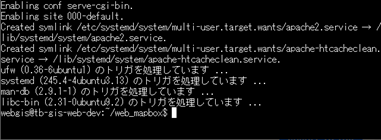


2. 使用するモードを通常とSSLの双方にします。
```
sudo ufw allow 'Apache Full'
```

3. ステータスを確認します。
```
sudo systemctl status apache2
```

4. 下記のような実行結果が表示され、3行目が「active(running)」と表示されていることを確認します。

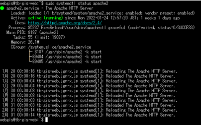

5. ブラウザから確認します。

ブラウザにWEBサーバのIPアドレスを入力し、下記のようなApache2の初期画面が表示されていればインストールできています(図 2-1)。

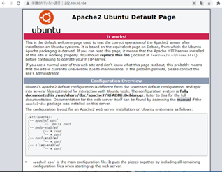

図 2-1 Apache2の初期画面

#### 各ミドルウェアへのリバースプロキシ設定
1. 下記コマンドを実行してプロキシを有効にします。
```
sudo a2enmod proxy
sudo a2enmod proxy_http
sudo a2enmod headers
```

2. confファイルに追記します。
```
vi /etc/apache2/sites-available/mapbox.conf
```
```
<Proxy *>
    Require all granted
</Proxy>
ProxyRequests Off
ProxyPreserveHost On
ProxyPass /api http://localhost:8081/api
ProxyPassReverse /api http://localhost:8081/api
ProxyPass /geoserver http://localhost:8085/geoserver
ProxyPassReverse /geoserver http://localhost:8085/geoserver
```

3. Apacheを再起動します。
```
sudo systemctl restart apache2
```

#### WEBサーバ証明書の設定
1. Cerbotのインストール
```
sudo apt install certbot python3-certbot-apache
```

2. mod_sslを有効化
```
sudo a2enmod ssl
```

3. SSL証明書の取得
```
sudo certbot --apache
```

4. confファイルのコピー
```
cd /etc/apache2/sites-available
sudo cp default-ssl mapbox.conf
```

5. 上記confを有効にする
```
sudo a2ensite mapbox.conf
```

5. 他の有効になっているconfを無効にする
```
sudo a2dissite default-ssl.conf
sudo a2dissite 000-default.conf
```

6. 設定の確認
```
sudo apache2ctl configtest
```

7. 下記のように「OK」が表示されることを確認します。

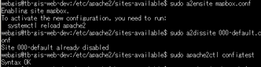

8. apache2の再起動
```
sudo systemctl restart apache2
```

9. ブラウザの確認

httpsにて警告メッセージなく表示されることを確認します。


### GeoServer
#### GeoServer及び依存パッケージについて
GeoServerはWebブラウザなどが利用する地理情報を配信するJavaアプリケーションです。ここでは、GeoServerインストールおよび併せて必要なOpenJDK、Tomcatのインストールについて説明します。

#### パッケージインデックスの更新
GeoServer及び依存パッケージはWebサーバ(tb-gis-db.xxx.jp)へインストールします。次のコマンドを実行して下さい。

1. パッケージインデックスを更新
```
sudo apt -y update
```

パッケージインデックスについて、GeoServer以外の構築で直前に更新している場合は実行不要です。

#### OpenJDKのインストール
次のコマンドを実行して下さい。

1. OpenJDKをインストール
```
sudo apt install default-jre
```

#### Tomcatのインストール
次のコマンドを実行して下さい。

1. Tomcatをインストール
```
sudo apt install tomcat9 tomcat9-admin
```

2. サービスを有効にします。
```
sudo systemctl enable tomcat9
```

#### Tomcatの設定変更
設定ファイルの編集は以下のコマンドで開始することができます。

1. 設定ファイルを変更
```
sudo nano /etc/tomcat9/tomcat-users.xml
```

configurationSampleに含まれる[tomcat-users.xml](./configurationSample/ENVIRONMENT/tomcat-users.xml)を参考に設定を変更して下さい。以下の内容を追記します。

```
<role rolename="admin-gui"/>
<role rolename="manager-gui"/>
<user username="tomcat" password="pass" roles="admin-gui,manager-gui"/>
```

#### Tomcatの開始
次のコマンドを実行して下さい。

1. 起動
```
sudo systemctl restart tomcat9
```

#### GeoServerのインストール
以下の4つのコマンドを実行し、GeoServerのインストールを行います。また、本マニュアルでは、GeoServer2.20.1を使用した説明となります。

1. GeoServerパッケージ(ZIPファイル)の取得
```
sudo wget https://sourceforge.net/projects/geoserver/files/GeoServer/2.20.1/geoserver-2.20.1-war.zip
```

2. GeoServerパッケージ(ZIPファイル)の配置
```
sudo mv geoserver-2.20.1-war.zip /var/lib/tomcat9/webapps
```

3. 配置ディレクトリへ移動
```
cd /var/lib/tomcat9/webapps
```

4. GeoServerパッケージ(ZIPファイル)の展開
```
sudo unzip geoserver-2.20.1-war.zip
```

#### GeoServerのポート設定(Apacheの設定変更)
GeoServerがデフォルトで利用するポートは8080ですが、本システムでは8085を使用します。Apacheの設定ファイル(/etc/apache2/sites-enabled/default.conf)を編集します。設定ファイルの編集は以下のコマンドで開始することができます。

1. 設定ファイルを変更
```
sudo nano /etc/apache2/sites-enabled/default.conf
```

configurationSampleに含まれる[default.conf](./configurationSample/ENVIRONMENT/default.conf)を参考に設定を変更して下さい。以下の内容を追記します。

```
ProxyPass /geoserver http://localhost:8085/geoserver
ProxyPassReverse /geoserver http://localhost:8085/geoserver
```

ここまでの設定を反映するため、一度Tomcat、Apacheを再起動します。以下の2つのコマンドを実行して下さい。

1. Tomcatの再起動
```
sudo systemctl restart tomcat9
```

2. Apacheの再起動
```
sudo systemctl restart apache2
```

#### SSL対応(証明書の作成と設定)
SSL対応(https対応)を行うため、証明書の作成と設定を行います。以下の2つのコマンドを実行して下さい。

1. Tomcatの設定ディレクトリへ移動
```
cd /var/lib/tomcat9/conf
```

2. 証明書の作成
```
sudo keytool -genkey -alias tomcat -keyalg RSA -keystore tomcat.keystore -validity 3650
```

次に、作成した証明書の情報をTomcat設定に追記します。設定ファイルの編集は以下のコマンドで開始することができます。

1. 設定ファイルを変更
```
sudo nano /etc/tomcat9/server.xml
```

configurationSampleに含まれる[server.xml](./configurationSample/ENVIRONMENT/server.xml)を参考に設定を変更して下さい。以下の内容を追記します。既存の8443ポート設定がある場合はコメントアウトが必要です。

```
<Connector port="8443" protocol="org.apache.coyote.http11.Http11NioProtocol"
     maxThreads="150" SSLEnabled="true" >
<SSLHostConfig>
    <Certificate certificateKeystoreFile="conf/tomcat.keystore"
                 certificateKeystorePassword="P@ssw0rd"
                 certificateKeyAlias="tomcat"
                 certificateKeystoreProvider="SUN"
                 certificateKeystoreType="JKS"
                 type="RSA" />
</SSLHostConfig>
</Connector>
```

#### GeoServerの名前解決設定
GeoServerの名前解決を行うため、以下の情報をGeoServerの設定に追記します。設定ファイルの編集は以下のコマンドで開始することができます。

1. 設定ファイルを変更
```
sudo nano /var/lib/tomcat9/webapps/geoserver/WEB-INF/web.xml
```

configurationSampleに含まれる[web.xml](./configurationSample/ENVIRONMENT/web.xml)を参考に設定を変更して下さい。以下の内容を追記します。

```
<context-param>
  <param-name>PROXY_BASE_URL</param-name>
  <param-value>https://xxx.jp/geoserver</param-value>
</context-param>

<context-param>
  <param-name>GEOSERVER_CSRF_WHITELIST</param-name>
  <param-value>xxx.jp</param-value>
</context-param>
```

ここまでの設定を反映するため、Tomcatを再起動します。以下のコマンドを実行して下さい。

1. Tomcatの再起動
```
sudo systemctl restart tomcat9
```

以下のコマンドを実行して正常なレスポンスが返れば、構築は成功です。Webブラウザから [https://localhost:8443/](https://localhost:8443/) へアクセスして、GeoServerの管理を行うことができます(図 2-1、図 2-2)。
Geoserverはデフォルトではユーザ名：admin、パスワード：geoserverとなっているため、適切な強度を持ったものを設定して下さい。

1. GeoServer管理インターフェースへのアクセス
```
curl -k https://localhost:8443/
```

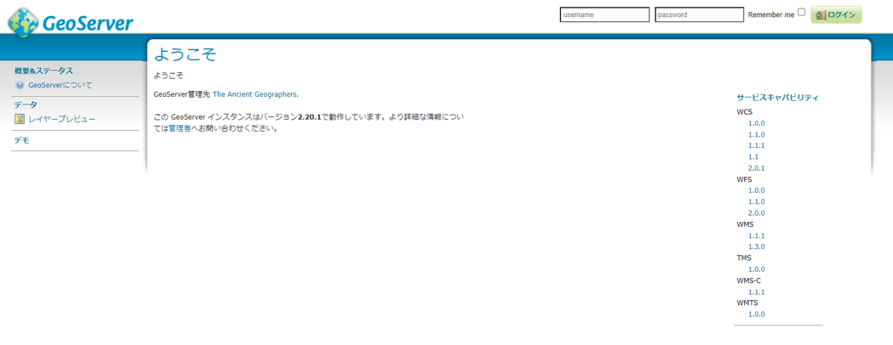

図 2-1 GeoServerの管理インターフェース(ログイン前)

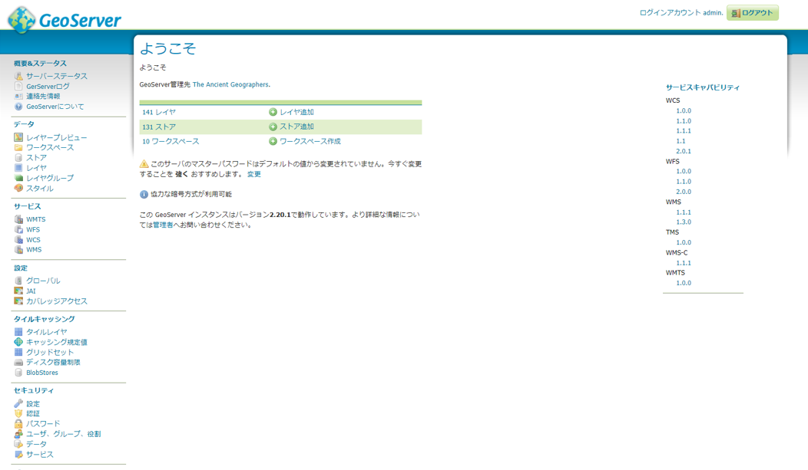

図 2-2 GeoServerの管理インターフェース(ログイン後)


### KrakenD
#### インストール
作業ディレクトリはログインユーザのディレクトリとします。

下記コマンドを実行します。

（１，２行目：krakendのキーの登録、３行目：パッケージリストの更新）
```
sudo apt-key adv --keyserver hkp://keyserver.ubuntu.com:80 --recv 5DE6FD698AD6FDD2
sudo echo "deb https://repo.krakend.io/apt stable main" | sudo tee /etc/apt/sources.list.d/krakend.list
sudo apt-get update
sudo apt-get install -y krakend
```
インストールすると、下記のようなメッセージが表示されます。

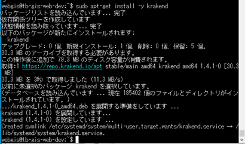

#### ディレクトリ作成
```
mkdir krakend
```

#### 設定ファイルの配置
configurationSampleに含まれる設定ファイル[krakend.json](./configurationSample/ENVIRONMENT/krakend.json)上記ディレクトリに配置します。

#### 公開サーバの変更
設定ファイルに記載されている下記URLは公開サーバのURLに変更してください。
```
https://tb-gis-web.jgn-x.jp
```

#### KrakenDのポート設定
WebAPIは5000番ポート、GeoServerは8085番ポートで起動していない場合は下記記述のポート番号を変更してください。
```
localhost:5000 
localhost:8085
```

#### KrakenDの認証設定
認証を使用しない場合は上記記述を削除してください。（複数個所あります）
```
"extra_config": {
	"auth/validator": {
		"alg": "RS256",
		"audience": ["https://tb-gis-web.jp.auth0.com/api/v2/"],
		"jwk_url": "https://tb-gis-web.jp.auth0.com/.well-known/jwks.json"
	}
},
```

#### 起動
下記コマンドを実行し、バックグラウンドで起動させます。
```
cd krakend
nohup krakend run --config krakend.json &;
```

#### 停止
1. 下記コマンドを実行し、実行プロセスを表示します。
```
ps aux | grep krakend
```
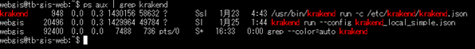

2. 一覧の「krakend run」のプロセスIDを指定し、プロセスを終了します。
（プロセスIDは起動ごとに異なります。）

```
kill 20496
```

### FastAPI
#### pip3のインストール（インストールされていない場合のみ）
1. 下記コマンドを実行します。
```
sudo apt update
sudo apt install python3-pip
```

2. 確認メッセージでは「Y」を入力します。

下記のような実行結果が表示されます。

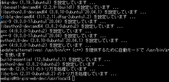

#### 各種フレームワーク
1. 下記コマンドを実行し各種フレームワークをインストールします。
```
pip3 install fastapi
pip3 install db
pip3 install databases
pip3 install sqlalchemy
pip3 install starlette
pip3 install uvicorn
pip3 install python-dotenv
```

2. インストールされたことを確認します。
```
pip3 list
```
成功していれば、フレームワーク名が表示されます。

#### 設定ファイルの設置
apiディレクトリ配下に下記コードを配置します。
```
https://github.com/nict-testbed-dalab/Data_api_Component
```

#### FastAPIのポート設定
.envファイルのデータベース接続情報からポートなどの設定を変更できます。
```
DB_HOST=tb-gis-db　←ホスト名
DB_PORT=5432　←ポート
DB_NAME=tb ←データベース名
DB_USER=webgis　←ユーザ名
DB_PW=　←パスワード
```

#### 起動
APIのフォルダに移動し、uvicornをバックグラウンドで実行します。
リロードモードでの実行のため、ソース修正時は自動的に反映されます。
```
cd /home/webgis/api
nohup python3 -m uvicorn main:app --reload --port 5000 &
```

#### 停止
1. 下記コマンドを実行し、実行プロセスを表示します。
```
ps aux | grep uvicorn
```
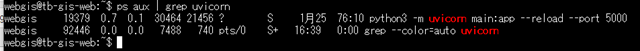

2. 次に、一覧の「python3 -m uvcorn」のプロセスIDを参照し、下記コマンドを実行します。（プロセスIDは起動ごとに異なります。）

```
kill 19379
```

### Node.js
#### nodejsインストール実行
1. 下記コマンドを実行し、nodejsをインストールします。
```
sudo apt install nodejs
```
下記のようなメッセージが表示されます。

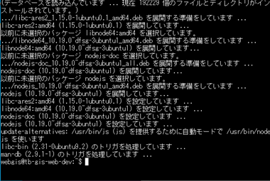

2. バージョン情報を表示し、インストールされたことを確認します。
```
node --version
```
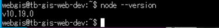

#### npmインストール実行
1. 下記コマンドを実行し、npmをインストールします。
```
sudo apt install npm
```
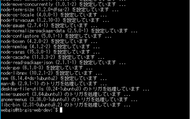

2. バージョン情報を表示し、インストールされたことを確認します。
```
npm --version
```
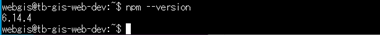

## データ取得変換ツール
### 前提条件および概要
データ取得変換ツールでは、収集したデータを必要に応じてデータ分析・可視化システムで利用可能な形に変換します。変換したファイルをWebサーバに配置する、又は直接Webサーバを出力先として変換配置することでWebGISから参照可能となり、本システムにデータを追加できます。本システムからのデータ削除は、配置又は変換配置したファイルの削除により可能です。ただし、収集データうちGeoServerへ登録して配信するものについては、GeoServerへの登録/削除により本システムへの追加/削除を行います。


#### データ取得変換ツールの実行場所
データ取得変換ツールは、予めデータ取得変換ツールの依存パッケージを導入した上で、任意のディレクトリ（以下「対象ディレクトリ」）にツールを設置し、実行します。取得または変換データは対象ディレクトリ下に保存されます。以下の説明に従ってデータ取得変換ツールを使用する場合は、初めに対象ディレクトリに移動して下さい。


### データ取得変換ツールの構成について
データ取得変換ツールは、表 1の2つの個別ツールで構成されます。

表 1　個別ツール一覧
|個別ツール名                |用途                                                                      |
|----------------------------|--------------------------------------------------------------------------|
|地理空間情報データ変換ツール|国土数値情報(シェープファイル)のバイナリベクトルタイル形式への変換        |
|3次元建物データ変換ツール   |国土交通省PLATEAUによる3次元建物データのバイナリベクトルタイル形式への変換|


### データ取得変換ツール依存パッケージのインストール
#### unzipのインストール手順
データ取得変換ツールに必要なunzipのインストールについて記述します。

次のコマンドを実行して下さい。

1. unzipインストール
```
sudo apt install unzip
```

#### gdalのインストール手順
データ取得変換ツールに必要なgdalのインストールについて記述します。
本マニュアルでは、gdal 3.4.0を使用した説明となります。

次のコマンドを実行して下さい。

1. gdalインストール
```
sudo apt install gdal-bin
```

2. gdalのバージョン確認
```
ogr2ogr --version
```

「GDAL 3.0.4, released 2020/01/28」が表示されていれば成功です。

3. gdal更新用のリポジトリ追加
```
sudo add-apt-repository ppa:ubuntugis/ubuntugis-unstable
```

画面の指示に従ってエンターキーを押し、追加を完了します。

4. パッケージの更新
```
sudo apt upgrade
```

5. gdalのバージョン確認
```
ogr2ogr --version
```

「GDAL 3.4.0, released 2021/11/04」以降が表示されていれば成功です。


#### makeのインストール手順
unzipのインストール手順で必要なmake及び関連パッケージのインストールについて記述します。

次のコマンドを実行して下さい。

1. make及び関連パッケージのインストール
```
sudo apt install sqlite3 libsqlite3-dev
```

#### tippecanoeのインストール手順
地理空間情報データ変換ツール及び3次元建物データ変換ツールの動作にはtippecanoeのインストールが必要です。ここでは、tippecanoeのインストールについて記述します。

次の3つのコマンドを実行して下さい。

1. tippecanoeを取得
```
git clone https://github.com/mapbox/tippecanoe.git
```

2. tippecanoeのビルド場所へ移動
```
cd tippecanoe
```

3. tippecanoeのビルド
```
make
```

4. tippecanoeのインストール
```
sudo make install
```


### データ取得変換ツールのインストール
本リポジトリから
DataPreparationToolの以下ファイルを対象ディレクトリに配置して下さい。

対象ディレクトリに、
- data_preparation_tool_mvt.sh
- data_preparation_tool_3d_mvt.sh

が配置されていれば構築は成功です。 


### 運用
本システムでは、標準で[DataCatalog.pdf](/DataCatalog.pdf)の対象データを運用できるようになっています。また、形式が同一のデータであれば利用者が独自にデータを追加して運用することが可能です。

### データ収集
[DataCatalog.pdf](/DataCatalog.pdf)に記載されているデータ取得元から、本システムで運用したデータを収集して下さい。対象となるデータには年度更新(数年に一度の更新も含む)のあるものもあり、更新があった場合には最新のデータを追加して本システムを運用することが可能です。

#### 国土地理院が提供するダウンロードツールによる地理院タイルの収集
国土地理院は、国土地理院が公開する地理院タイルについてダウンロードツールを公開しています。

地理院タイルダウンロードツール

[https://github.com/gsi-cyberjapan/tdlmn](https://github.com/gsi-cyberjapan/tdlmn)

導入手順書及び使用マニュアル

[https://github.com/gsi-cyberjapan/tdlmn/blob/main/docs/導入手順書及び使用マニュアル.pdf](https://github.com/gsi-cyberjapan/tdlmn/blob/main/docs/%E5%B0%8E%E5%85%A5%E6%89%8B%E9%A0%86%E6%9B%B8%E5%8F%8A%E3%81%B3%E4%BD%BF%E7%94%A8%E3%83%9E%E3%83%8B%E3%83%A5%E3%82%A2%E3%83%AB.pdf)

この導入手順に従って、ツールで推奨されているWindow10+Ruby環境で

```
ruby tdlmn.rb -mn -dt -merge
```

を実行することにより、タイルのダウンロードが可能です。


本システムに標準で収集、公開されているデータは、表 2のとおりです。program.iniのTILE_ID、ZOOM_LEVEL、TILE_FOLDERを都度変更してコマンドを実行し、タイルをダウンロードして下さい。

表 2　使用タイル一覧
|タイル名        |TILE_ID           |ZOOM_LEVEL                          |TILE_FOLDERについて                               |
|----------------|------------------|------------------------------------|--------------------------------------------------|
|航空写真        |seamlessphoto     |2,3,4,5,6,7,8,9,10,11,12,13,14,15,16|任意の作業ディレクトリを指定して実行し、ファイルを保存|
|淡色地図        |pale              |5,6,7,8,9,10,11,12,13,14,15,16,17,18|任意の作業ディレクトリを指定して実行し、ファイルを保存|
|標準地図        |std               |5,6,7,8,9,10,11,12,13,14,15,16      |任意の作業ディレクトリを指定して実行し、ファイルを保存|
|地理院地図Vector|experimental_bvmap|5,6,7,8,9,10,11,12,13,14,15,16      |任意の作業ディレクトリを指定して実行し、ファイルを保存|

※ZOOM_LEVEL指定は改行なしで指定

国土地理院の推奨環境はWindows10 + Ruby3.0.0だが、Linux（Ubuntu）でも実行可能です（未確認）。

#### 3D都市モデル（Project PLATEAU）の収集
本システムでは、国土交通省のProject PLATEAU

[https://www.mlit.go.jp/plateau/](https://www.mlit.go.jp/plateau/)

(3D都市モデル（Project PLATEAU）ポータルサイト)

[https://www.geospatial.jp/ckan/dataset/plateau](https://www.geospatial.jp/ckan/dataset/plateau)

により整備、公開されているMVT 形式の3D都市モデルを表示することが可能です。また、CityGMLとしてしか公開されていないものについても、収集時にQIGSでGeoJSONファイルに変換して保存することにより、データ取得変換ツールでGeoJSON からMVT形式に変換して利用することができます。以降では、この方法について記述します。CityGMLがzipファイルに圧縮されている場合は、「地理空間情報データ変換ツールの利用」の手順で展開して下さい。


1. QGISのバージョン確認

QGISは3.16以降、かつQGISに同梱のGDALのバージョンは3.4以降で利用して下さい。JVN上(CUI)でのQGIS操作となるため、QGISが利用できるPythonコンソールで作業します。以下の説明で、日本語込みの[](例：[レイヤ名])はPython配列ではなく、コマンド実行時に置き換える箇所を示します。

(参考)
対応するQGISがインストールされていない場合は、

```
sudo add-apt-repository ppa:ubuntugis/ubuntugis-unstable
sudo apt upgrade
sudo apt install qgis
```

でインストールが可能です。インストールするタイミングにより公開場所が変わっている可能性もあるため、確認の上導入して下さい。


2. QGIS (Pythonコンソールから使用)の起動

次のコマンドを順に実行して、QGIS を起動して下さい。はじめに、Processingを利用できるよう設定します。

```
export QT_QPA_PLATFORM=offscreen
python3
import sys
from qgis.core import (QgsApplication, QgsVectorLayer)

QgsApplication.setPrefixPath('/usr', True)
qgs = QgsApplication([], False)
qgs.initQgis()

sys.path.append('/usr/share/qgis/python/plugins')

import processing
from processing.core.Processing import Processing
Processing.initialize()
```

3. CityGMLの読み込み

次のコマンドを実行して、CityGMLをQGISのレイヤとして読み込んで下さい。

```
[レイヤ] = QgsVectorLayer([CityGMLファイルのパス], [レイヤ名], 'ogr')

(例) samplelayer = QgsVectorLayer('sample.gml', 'sample', 'ogr')
```


4. GeoJSONの保存設定

次のコマンドを実行して、CityGMLをQGISのレイヤとして読み込んで下さい。

```
params = { 
    'LAYERS' : [レイヤ],
    'CRS' : 'EPSG:4326',
    'OUTPUT' : [保存するGeoJSONファイルのパス]
}

(例)
params = { 
    'LAYERS' : samplelayer,
    'CRS' : 'EPSG:4326',
    'OUTPUT' : 'sample.geojson'
}
```

5. GeoJSONの保存

次のコマンドを実行して、GeoJSONファイルを保存して下さい。
```
processing.run('native:mergevectorlayers', params)
```

[保存するGeoJSONファイルのパス]で指定したディレクトリにGeoJSONファイルが保存されていれば、GeoJSON形式での保存は完了です。


6. QGIS (Pythonコンソールから使用)の終了

次のコマンドを実行して、QGIS (Pythonコンソールから使用)を終了して下さい。
```
exit()
```

同等の操作は、Ubuntuをデスクトップモードで起動した場合やWindows10にインストールしたQGISで行う場合にはGUI操作で行うことが可能です。また、QGISのGUIに用意された専用のPythonコンソールから行うことも可能です。


### 地理空間情報データ変換ツールの利用
#### GMLからGeoJSONへの変換

1. 収集したzipファイル(GML)を展開します。
```
unzip -d [展開先の指定フォルダへのパス] [展開したいzipフォルダへのパス]
```

2. 展開したフォルダにはシェープファイルが格納されています。このファイルをGeoJSONへ変換します。
```
ogr2ogr -f GeoJSON [出力先のフォルダ] [変換したいshp形式のファイルへのパス]
```

#### GeoJSONからMVTへの変換

data_preparation_tool_mvt.shを実行して、GeoJSON形式のデータをMVTに変換します。

利用方法は

```
data_preparation_tool_mvt.sh [MVTを出力したいフォルダ名のパス] [作成したい最大のズームレベル] [MVTファイルに変更したいGeoJSONデータのパス]
```

です。

(参考) 直接tippecanoeを実行する場合

tippecanoeでGeoJSON形式のデータをMVTに変換します。

```
tippecanoe -e [MVTを出力したいフォルダ名のパス] -pC -z[作成したい最大のズームレベル] -aN [MVTファイルに変更したいGeoJSONデータのパス]
```

### 3次元建物データ変換ツールの利用
#### GeoJSONからMVTへの変換

data_preparation_tool_3d_mvt.shを実行して、GeoJSON形式のデータをMVTに変換します。

利用方法は

```
data_preparation_tool_3d_mvt.sh [作成したい最大のズームレベル] [MVTを出力したいフォルダ名のパス] [レイヤ名] [MVTファイルに変更したいGeoJSONデータのパス]
```

です。

(参考) 直接tippecanoeを実行する場合
tippecanoeでGeoJSON形式のデータをMVTに変換します。

```
tippecanoe -pC -ad -an -ps -z[作成したい最大のズームレベル] -e [MVTを出力したいフォルダ名のパス] -l [レイヤ名] -ai [MVTファイルに変更したいGeoJSONデータのパス]
```

※オプションpsをつけないと、建物が合成され、形が崩れて表示される箇所が発生するため、このオプションは必ず指定して下さい。

＜オプション一覧＞
- -e：出力フォルダの指定
- --no-tile-compression：ファイル圧縮の抑制
- -z：出力するズームレベルの指定
- -l：出力に使用するレイヤ名の指定
- -ai：IDの自動付番
- -ad：各ズームレベルから機能の一部を動的にドロップして、大きなタイルを500Kのサイズ制限未満に保ちます。
- -an：各ズームレベルから最小のフィーチャ（物理的に最小：最短の線または最小のポリゴン）を動的にドロップして、大きなタイルを500Kのサイズ制限未満に保ちます。
- -ps：線と多角形を単純化しないでください

オプションは下記のサイトを参考にして下さい。

[https://github.com/mapbox/tippecanoe#line-and-polygon-simplification](https://github.com/mapbox/tippecanoe)


### GeoServerへのGeoTiffの登録
#### ワークスペースの準備
本システムで利用するワークスペースが未作成の場合は、予めワークスペースの作成を行います(図 3-1)。

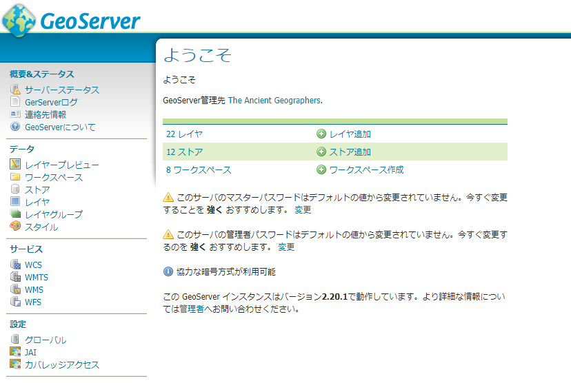

図 3-1　ワークスペース作成

サイドメニューの「ワークスペース」から、「新規ワークスペース追加」でも同様にワークスペースを作成できます。

NameとネームスペースURIを設定し、送信をクリックします。NAMEとネームスペースURIは自由に設定してください(図 3-2)。

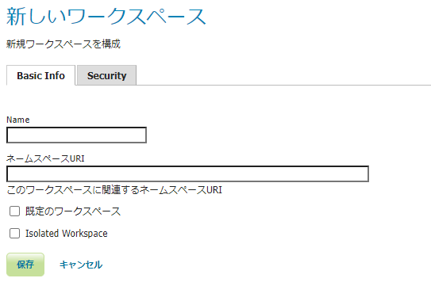

図 3-2　ワークスペース作成(入力)

サイドメニューの「ワークスペース」をクリックすると、ワークスペースの一覧が表示されるので、先ほど作成したワークスペースをクリックしてください。
ワークスペース編集のページに遷移するので、「WMTS」にチェックをつけて保存してください(図 3-3)。

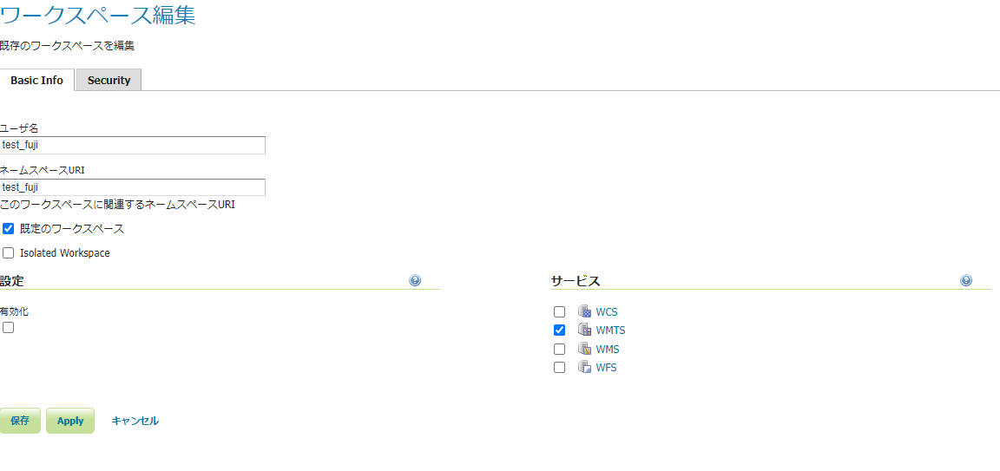

図 3-3　ワークスペース作成(設定)


##### GeoTiffデータの登録
サイドメニューの「ストア」をクリックし、「ストア新規追加」をクリックしてください。
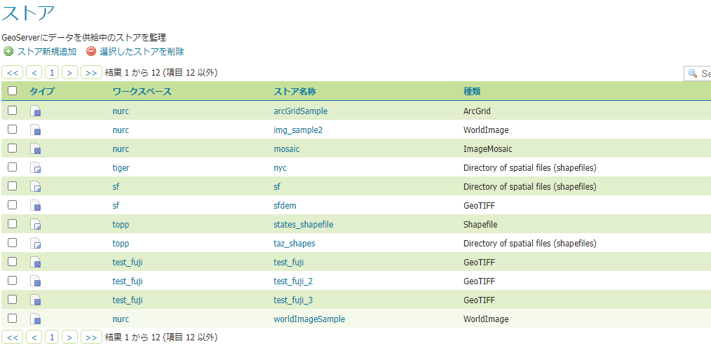

図 3-4　ワークスペース作成(設定)


新規データソースのページに遷移するので、ラスターデータソースに内にある「GeoTIFF」をクリックします。

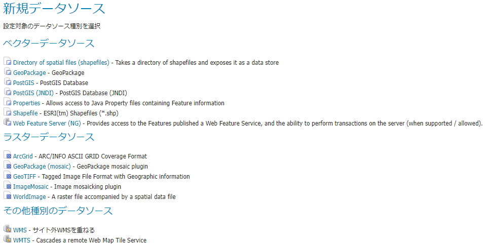

図 3-5　ワークスペース作成(設定)


「GeoTIFF」をクリックすると、ラスターデータの追加のページに遷移します。「ワークスペース」を事前に作成したものを選択し、「データソース名」は任意に設定してください。「URL」には、tifデータが置いてあるディレクトリを指定し、保存してください。

例）file:/ファイルパス/\~.tif

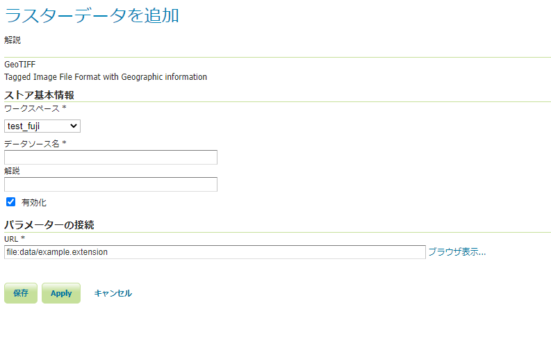

図 3-6　ワークスペース作成(設定)


保存をクリックすると、新規レイヤの画面に遷移するので、「公開」をクリックしてください。

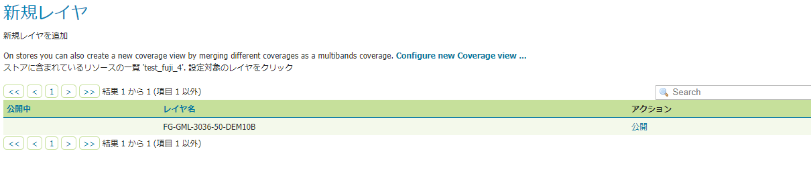

図 3-7　ワークスペース作成(設定)


「公開」をクリックすると、レイヤ編集ページに移動します。設定を変更せずに画面下の「保存」をクリックしてください。

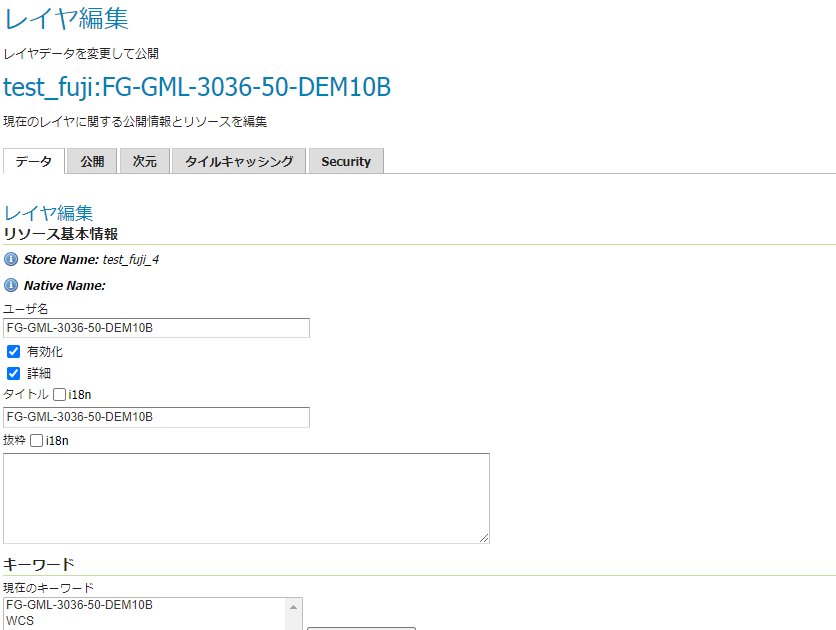

図 3-8　ワークスペース作成(設定)


サイドメニューの「レイヤ」に移動すると、先ほど作成したレイヤが追加されています。

サイドメニューの「レイヤプレビュー」から作成されたレイヤの「OpenLayers」をクリックすると、以下のように追加したレイヤがWMTSで配信されているのが確認できます。

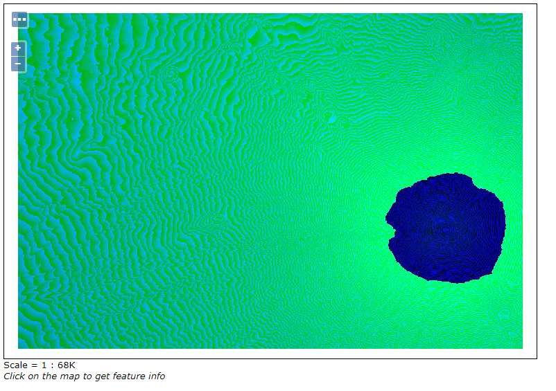

図 3-9　ワークスペース作成(設定)


#### レイヤのグループ化
複数のレイヤをひとつにまとめる場合は、サイドメニューの「レイヤグループ」をクリックし、「レイヤグループの新規追加」を選択してください。

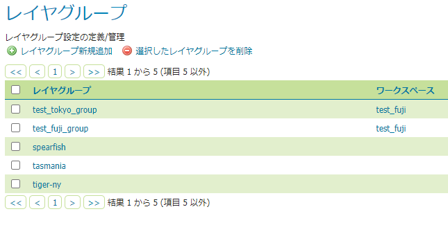

図 3-10　ワークスペース作成(設定)


「レイヤグループの新規追加」をクリックすると、レイヤグループの画面に遷移するので、「ユーザ名」と「タイトル名」を任意で設定し、「ワークスペース」を先ほど作成したものを選択します。
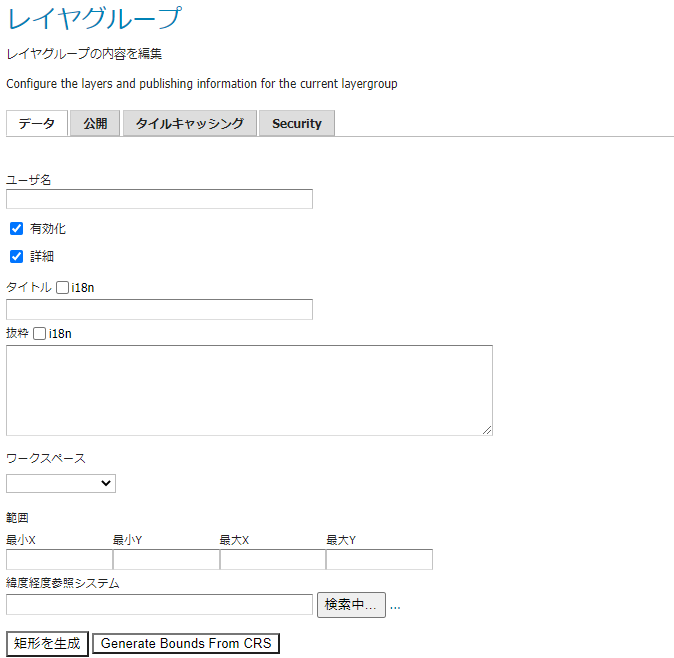

図 3-11　ワークスペース作成(設定)


「レイヤ追加」をクリックすると、ポップアップが表示されるので、追加したレイヤを全て選択してください。

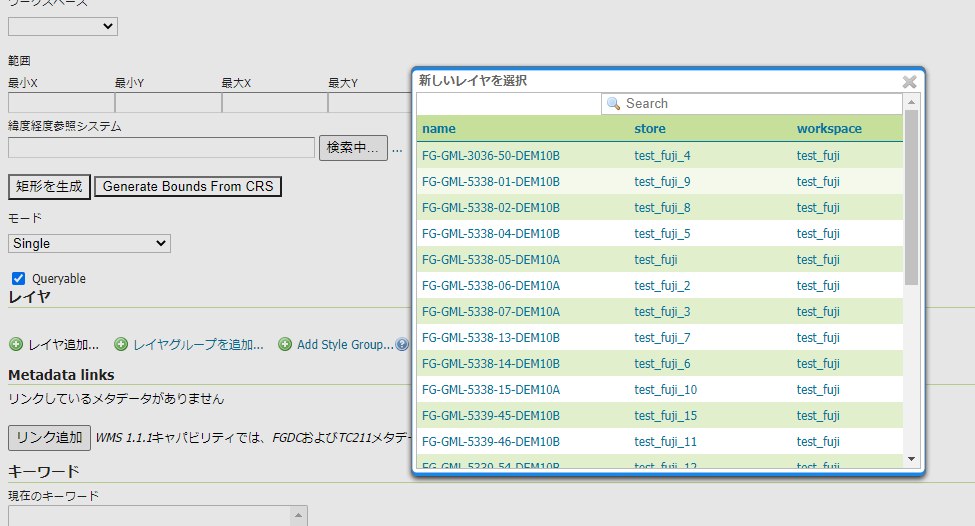

図 3-12　ワークスペース作成(設定)


「短径を生成」をクリックすると、追加されたレイヤの範囲を自動で読み取り、最小Xなどの項目にバウンディングボックスが生成されるので、一番下の保存をクリックし、設定を保存します。

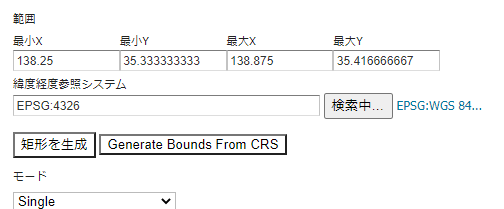

図 3-13　ワークスペース作成(設定)


設定が完了したら、サイドメニューの「レイヤグループ」のレイヤグループ一覧に先ほどグループ化したレイヤがあるか確認します。

確認後、サイドメニューの「レイヤプレビュー」からグループ化したレイヤの「OpenLayers」をクリックすると、以下のように追加したレイヤがWMTSで配信されているのが確認できます。
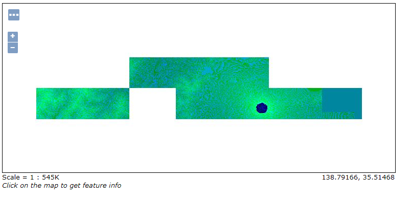

図 3-14　ワークスペース作成(設定)


### style.jsonの記述によるベクトルタイル地図のデザイン
タイルに対してstyle.jsonを記述して、ベクトルタイル地図のデザインを行います。サンプル記述や既存のベクトルタイルを参考にして、style.jsonを作成して下さい。また詳細については

[https://docs.mapbox.com/mapbox-gl-js/style-spec/](https://docs.mapbox.com/mapbox-gl-js/style-spec/)

を参考にして下さい。


#### style.jsonサンプル

```
{
    "version": 8,
"type": "overlay",
"format": "pbf",
    "glyphs":"https://maps.gsi.go.jp/xyz/noto-jp/{fontstack}/{range}.pbf",
    "sources": {
        "mvt": {
            "type": "vector",
            "tiles": [
                "https://xxx.jp/storage/data/vectortile/1_a_3_2_tochi/style.json"
            ]
        }
    },

"layers": [
    {
        "id": "Lineex",
        "source": "mvt",
        "source-layer": "1_a_4_1_hinansisetu",
        "minzoom": "0",
        "maxzoom": "14",
        "type": "line",
        "paint": {
          "line-color": "#000000",
            "line-width": 1,
            "line-opacity": 1.0
        }
    },
        {
            "id": "line-1",
            "source": "mvt",
            "source-layer":"kaigansen",         
            "filter": ["==","C23_003","1"],
            "type":"symbol",
            "layout":
                {           
                    "symbol-placement": "point",
                    "text-allow-overlap": false,
                    "text-field":["literal","都道府県知事"],
                    "text-font":["NotoSansCJKjp-Regular"],
                    "text-anchor": "top",             
                    "text-rotation-alignment":"auto",
                    "text-pitch-alignment": "auto"
                },
            "paint": 
                {
                    "text-color":"rgba(0,0,0,1)",
                    "text-halo-color":"rgba(255,255,255,1)",
                    "text-halo-width":1
                }
        },
}
```

(サンプルの記述について)
「tiles」にstyle.jsonの場所を設定します
※サンプルにはラインとラベルの表示設定があります。

「layers」に表示用の設定を記述します
- id・・・任意の名称
- source-layer・・・geojsonのファイル名（拡張子抜き）
- type・・・主にline,polygon,circleなど種類があります。元データの形式に合わせます。
- filter・・・項目を追加すると、一定の条件の地物にのみスタイルが適用されます。サンプルの場合だと、地物の属性で、C23_005の値が1の地物にのみスタイルを適用することができます。

・ラベル
- symbol-placement・・・地物に対してラベルが表示される位置。
- text-allow-over-lap・・・他のラベルに重ねて表示させるかどうか。
- text-field・・・ラベルとして表示させる文字。
  - [“literal”, 愛知]・・愛知が表示される。
  - [“get”, C23_003]・・C23_003の値が表示される。
- text-rotation-alignment・・・ラベルの表示向き


作成したstyle.jsonはpbfフォルダとmetadata.jsonのある場所に保存しておきます。

## WebGISアプリケーション
### Mapbox
#### テンプレートアプリケーションの設置
[TemplateWebGIS_Mapbox](https://github.com/nict-testbed-dalab/TemplateWebGIS_Mapbox)からMapbox_map、css、img、js、timeline、auth_config.json、index.htmlを取得し、
/var/www/html/mapbox_template/
へ配置して下さい。このディレクトリの内容が

となっていれば、正しく配置できています。

その後、対応Webブラウザにより

`https://tb-gis-web.xxx.jp/mapbox_template`

へアクセスして、図 4-1のように地理情報が表示できれば設置は成功です。表示が成功しない場合は、環境構築の状況を確認して下さい。
もしくは、/js/の中にある各レイヤを設定している箇所を適宜修正してください。

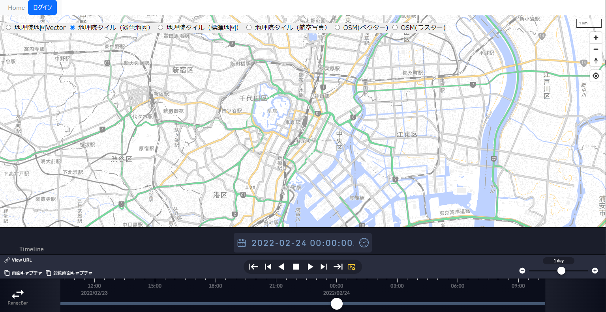

図 4-1　テンプレートアプリケーションの初期画面(Mapbox)


### iTowns
#### テンプレートアプリケーションの設置
[TemplateWebGIS_iTowns](https://github.com/nict-testbed-dalab/TemplateWebGIS_iTowns)からJSONLayers、data、font、jquery-k2go-timeline、projectNict、src、auth_config.json、index.html、package-lock.json、package.json、webpack.config.jsを取得し、

/var/www/html/itowns_template

へ配置して下さい。その後、下記コマンドを実行します。

```
npm install
npm audit fix　（*1）
npm run build

*1 インストールするモジュールのバージョンによっては、セキュリティに関する警告が表示される場合がありますので、こちらのコマンドを実行してください。
```

その後、対応Webブラウザにより

`https://tb-gis-web.xxx.jp/itowns_template/`

へアクセスして、図 4-2のように地理情報が表示できれば設置は成功です。表示が成功しない場合は、環境構築の状況を確認して下さい。
もしくは、/JSONLayers/layers/の中にある各レイヤ設定ファイル（jsonファイル）の中にあるデータの参照先を適宜修正してください。

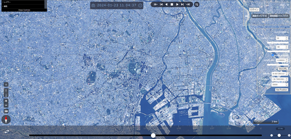

図 4-2　テンプレートアプリケーションの初期画面

#### (参考)iTownsのビルド環境も併せて構築する場合
テンプレートアプリケーションやサンプルアプリケーションを参考に独自のアプリケーションを開発する際、ベースとなっているiTownsのビルド環境も併せて構築すると、iTownsの公式サンプルによる学習を行いながら開発を進めることができます。

iTownsのビルド環境を構築する場合は下のURLを参考にして下さい。

iTownsリポジトリ
[https://github.com/iTowns/itowns](https://github.com/iTowns/itowns)

iTownsコーディングガイド
[https://github.com/iTowns/itowns/blob/master/CODING.md](https://github.com/iTowns/itowns/blob/master/CODING.md)

また、iTownsのバグ情報や開発の状況を知りたい場合は、次のURLを参考にして下さい。

iTowns issues
[https://github.com/iTowns/itowns/issues](https://github.com/iTowns/itowns/issues)

iTowns pull requests
[https://github.com/iTowns/itowns/pulls](https://github.com/iTowns/itowns/pulls)


### MapLibre
#### テンプレートアプリケーションの設置
[TemplateWebGIS_MapLibre](https://github.com/nict-testbed-dalab/TemplateWebGIS_MapLibre)からMaplibre_map、css、img、js、timeline、auth_config.json、index.htmlを取得し、
/var/www/html/mapbox_template/
へ配置して下さい。

以降の手順は、MapBoxと同様の手順となります。